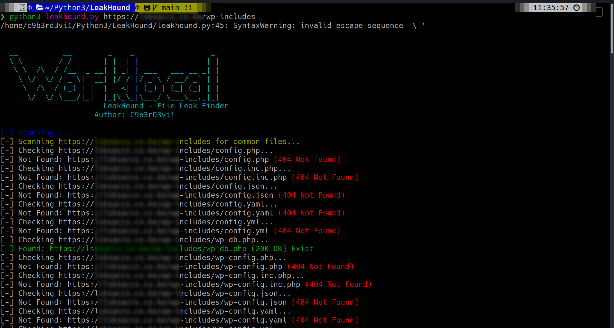

# 🐾 LeakHound — Sensitive File Sniffer

**LeakHound** is a Python-based security reconnaissance tool designed to sniff out commonly exposed or misconfigured sensitive files on web servers. It automates the detection of configuration files, credentials, backups, and other potential leaks that attackers commonly exploit.

---

## 🔍 Features

- Scans for **hundreds of known sensitive and backup file names**
- Supports **multithreaded scanning** for faster execution
- Clear and colorful CLI output using **Colorama**
- Customizable and extensible file list
- Gracefully handles errors, timeouts, and interruptions

---

## ⚙️ Installation

    git clone https://github.com/C9b3rD3vi1/LeakHound.git

    cd leakhound

    pip install -r requirements.txt

### 📦 Requirements

- Python 3.6+
- `requests` and `colorama` libraries

Install dependencies:

    pip install -r requirements.txt

Or install manually:

    pip install requests colorama

## 🚀 Usage

    python3 leakhound.py <url> [threads]

<url>: Target base URL (must start with http:// or https://)

[threads]: Optional. Number of concurrent threads to use (default: 10)

Example

    python3 leakhound.py https://example.com 20

## 🧠 How It Works

LeakHound iterates through a large list of common file paths and uses HEAD requests to check if those files exist on the target server. If a file is found (status 200 or 403), it's flagged as potentially sensitive.

The scan runs concurrently using Python's ThreadPoolExecutor, speeding up the process while avoiding server overload.

## 📂 Sample Files Scanned

    config.php, wp-config.php, .git/HEAD, credentials.json

    admin.php.bak, passwd.old, db.yaml

... and many more

You can customize the list in common_files inside the script.

## 🛑 Disclaimer

This tool is intended only for authorized security testing and educational purposes. Unauthorized scanning of websites is illegal and unethical.

Always obtain permission before using LeakHound on any system.

## 👨‍💻 Author

C9b3rD3vi1

Twitter: @C9b3rD3vi1_

GitHub: github.com/C9b3rD3vi1

Website: <https://cyberlocktech.com>

## 📄 License

This project is licensed under the MIT License.  
See the [LICENSE](LICENSE) file for details.